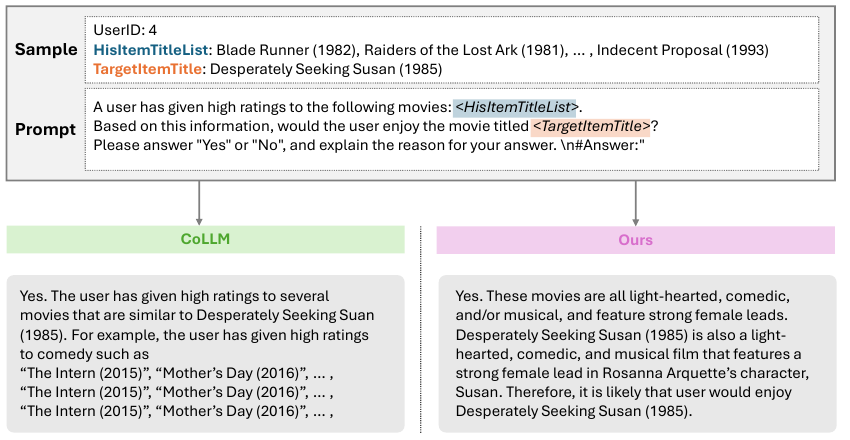

<div align="center">

# ARROW: Adaptive Reasoning for LLM-based Recommendation with Explainability

**[Woo-Seong Yun](https://scholar.google.com/citations?user=ZRXyvtMAAAAJ)** &nbsp;·&nbsp; **Min-Seong Kim** &nbsp;·&nbsp; **Yoon-Sik Cho**

<sub>Department of Artificial Intelligence, Chung-Ang University</sub>

*WSDM 2026 (19th ACM International Conference on Web Search and Data Mining), pp. 1283–1287, Boise, ID, USA*

[](https://dl.acm.org/doi/10.1145/3773966.3779396)
[](https://www.python.org/)
[](https://pytorch.org/)
[](https://creativecommons.org/licenses/by-nc-nd/4.0/)

</div>

This is the PyTorch implementation for our WSDM 2026 paper:

> ARROW: Adaptive Reasoning for LLM-based Recommendation with Explainability (WSDM, 2026)

<p align="center">
  
</p>

## Overview

Large language models have brought substantial gains to recommender systems through their world knowledge and reasoning ability. However, a *semantic gap* between the linguistic knowledge of LLMs and the collaborative patterns in interaction data hinders their fusion, so existing LLM-based recommenders achieve high accuracy yet cannot give a coherent rationale for their decisions, and often hallucinate items that are not in the user's history. To address these limitations, we propose **ARROW** (Adaptive Reasoning for LLM-based RecommendatiOn With explainability). ARROW guides the LLM with a chain-of-thought prompt that first infers the genres a user is likely to enjoy and then makes the recommendation, and it turns this reasoning step into a multi-label genre prediction task that is trained jointly with the recommendation objective. The **Adaptive Reasoning Modulator (ARM)** measures the entropy of the genre prediction and uses it to weight the reasoning loss per batch, so the model concentrates on reasoning exactly when it is uncertain. On ML-1M and Amazon-Book, ARROW outperforms strong LLM-based baselines such as CoLLM, BinLLM and CoRA on AUC, UAUC and NDCG while producing human-interpretable explanations, and it does so without relying on external genre metadata.

## Requirements

```bash
conda env create -f environment.yml
conda activate minigpt4
```

ARROW uses Vicuna-7B as the LLM backbone. Follow [PrepareVicuna.md](PrepareVicuna.md) to prepare the weights, then set `llama_model` in each file under `train_configs/` to the weight path.

## Datasets

We follow the preprocessing of [CoLLM](https://github.com/zyang1580/CoLLM). Ground-truth genre labels for the reasoning task are generated from item titles with Mistral-Nemo-Instruct.

| Dataset | Train | Valid | Test | Users | Items |
| --- | ---: | ---: | ---: | ---: | ---: |
| ML-1M | 33,891 | 10,401 | 7,331 | 839 | 3,256 |
| Amazon-Book | 727,468 | 25,747 | 25,747 | 22,967 | 34,154 |

Download [MovieLens-1M](https://grouplens.org/datasets/movielens/) and [Amazon-Books](https://cseweb.ucsd.edu/~jmcauley/datasets.html#amazon_reviews), then run the notebooks in `dataset/` to build the splits.

## Training

**Step 1. Pre-train the collaborative filtering model.**

```bash
python baseline_train_mf_ood.py
```

**Step 2. Stage 1 (LoRA tuning).** Set `pretrained_path` to the CF checkpoint and `ckpt: None` in `train_configs/collm_pretrain_mf_ood_stage_1.yaml`, then run:

```bash
CUDA_VISIBLE_DEVICES=0,1 WORLD_SIZE=2 torchrun --nproc-per-node 2 --master_port=11139 \
    train_collm_mf_din.py --cfg-path=train_configs/collm_pretrain_mf_ood_stage_1.yaml
```

**Step 3. Stage 2 (collaborative alignment).** Set `ckpt` to the best stage-1 checkpoint in `train_configs/collm_pretrain_mf_ood_stage_2.yaml`, then run the same command with the stage-2 config.

**Step 4. Evaluation.** Set `ckpt` to the best stage-2 checkpoint in `train_configs/collm_pretrain_mf_ood_stage_eval.yaml`, then run the same command with the eval config.

## Results

Bold marks the best result and underline the second best (Table 2 of the paper). All improvements are statistically significant (paired t-test, p ≤ 0.05).

| Method | ML-1M<br>AUC | ML-1M<br>UAUC | ML-1M<br>NDCG | Amazon-Book<br>AUC | Amazon-Book<br>UAUC | Amazon-Book<br>NDCG |
| --- | ---: | ---: | ---: | ---: | ---: | ---: |
| MF | 0.6482 | 0.6361 | 0.8447 | 0.7119 | 0.5554 | 0.8194 |
| SASRec | 0.7055 | 0.6885 | 0.8612 | 0.6829 | 0.5800 | 0.8244 |
| ICL | 0.5320 | 0.5268 | 0.8102 | 0.4820 | 0.4856 | 0.7917 |
| Prompt4NR | 0.7071 | 0.6739 | 0.8541 | 0.7224 | 0.5881 | 0.8346 |
| TALLRec | 0.7072 | 0.6743 | 0.8578 | 0.7209 | 0.5814 | 0.8361 |
| CoLLM (MF) | 0.7295 | 0.6798 | 0.8658 | 0.8107 | 0.6029 | 0.8557 |
| BinLLM | <u>0.7412</u> | 0.6951 | <u>0.8747</u> | <u>0.8186</u> | <u>0.6338</u> | <u>0.8580</u> |
| CoRA | 0.7410 | <u>0.7061</u> | 0.8728 | 0.8109 | 0.5975 | 0.8413 |
| **ARROW** | **0.7577** | **0.7146** | **0.8792** | **0.8198** | **0.6576** | **0.8653** |

## Citation

If you find this work useful, please cite:

```bibtex
@inproceedings{yun2026arrow,
  title     = {ARROW: Adaptive Reasoning for LLM-based Recommendation with Explainability},
  author    = {Woo-Seong Yun and Min-Seong Kim and Yoon-Sik Cho},
  booktitle = {Proceedings of the Nineteenth ACM International Conference on Web Search and Data Mining},
  series    = {WSDM '26},
  pages     = {1283--1287},
  year      = {2026},
  publisher = {ACM},
  doi       = {10.1145/3773966.3779396}
}
```

## Acknowledgements

This work was partly supported by the Institute of Information & Communications Technology Planning & Evaluation (IITP) grant funded by the Korea government (MSIT) [RS-2021-II211341, Artificial Intelligence Graduate School Program (Chung-Ang University)] and partly supported by the National Research Foundation of Korea (NRF) grant funded by the Korea government (MSIT) (No. RS-2024-00419201).

Our implementation builds on [CoLLM](https://github.com/zyang1580/CoLLM) and [BinLLM](https://github.com/zyang1580/BinLLM).
